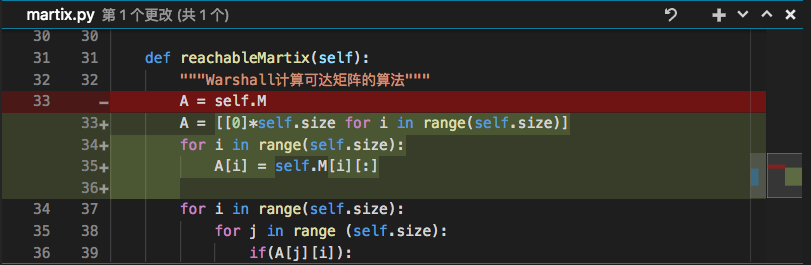
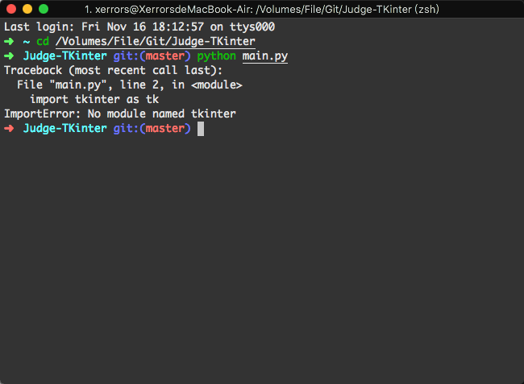
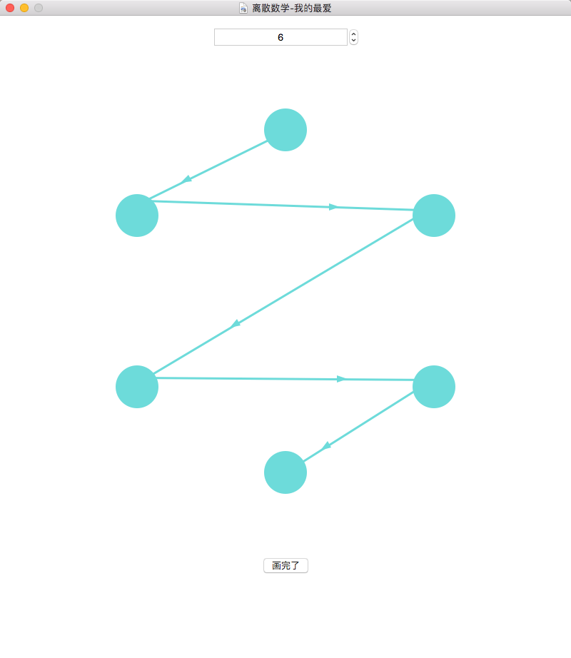
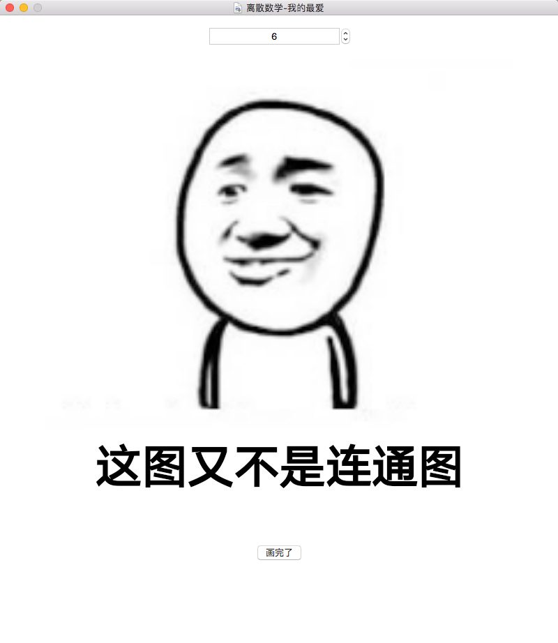
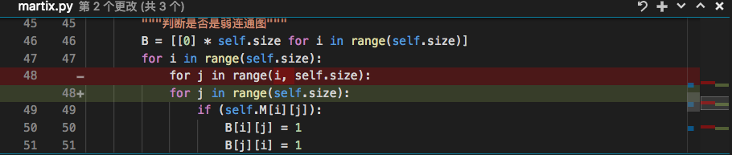
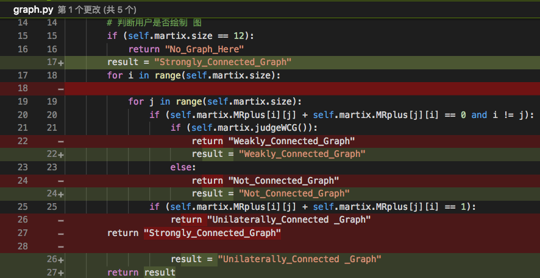

# Debug 的过程
1. 过了这么久才发现我对连通图的判断是错误的，看来是需要改一下判定的原理了。
目前对连通图的判定方法是：
```python 
if (self.martix.size == 12):
            return "No_Graph_Here"
        for i in range(self.martix.size):
            for j in range(self.martix.size):
                if (self.martix.M[i][j] + self.martix.M[j][i] == 0):
                    return "Weakly_Connected_Graph"
                if (self.martix.M[i][j] + self.martix.M[j][i] == 1):
                    return "Unilaterally_Connected _Graph"
        return "Strongly_Connected_Graph"
```
即只能是这三种图的一种，但是众所周知，不是所有牛奶都叫特仑苏，也不是所有图都是连通图，所以需要更改一下判定。

第一个想法是在判断是否是强、弱、单向之前先判断是否是连通的。判断方法是判断时候有节点的入度和出度之和是 0 的。

Emmm, 大概反应30秒之后，我意识到这个算法不对，，所以，再改！

其实我是有个大概思路的，就是把邻接矩阵对称一下，然后判断可达矩阵，这个时候就能判断是否 是弱连通了。

最终就是按照这个想法实现的。完美解决这个问题。

```python
def judgeWCG(self):
    """判断是否是弱连通图"""
    B = [[0] * self.size for i in range(self.size)]
    for i in range(self.size):
        for j in range(i, self.size):
            if (self.M[i][j]):
                B[i][j] = 1
                B[j][i] = 1

    for i in range(self.size):
        for j in range(self.size):
            if(B[j][i]):
                for k in range(self.size):
                    B[j][k] |= B[i][k]

    for i in range(self.size):
        for j in range(self.size):
            if (B[j][i] == 0):
                return False
    return True
```


2. 对数组的复制操作



由于在Python中，如果是对数组 A 和数组 B 进行如下操作的话，`A = B` 并不会复制一份数组，而是将 B 数组的地址赋给了 A， 对 A 进行操作修改的同时，B 的值也在发生改变。所以需要用到循环来进行赋值，如图绿色区域。

3. 必须使用 Python3 来执行。



由于我使用 homebrew 安装的 python 版本是 2.7 版本，所以如果使用了终端默认的 python 的话，会默认使用 Python2.7 来执行，而 tkinter 在Python2.7 的版本中引用的时候需要使用 import Tkinter 来引用，所以出现了报错，所以需要使用 python3 main.py 来执行python文件才能不报错。

4. 对连通图的判断不准确

如图所示是一个单向连通的图，即任意两个节点直接最少有一个方向是有路的，但是判定结果是这个图不是连通的图。



这是判定的结果：



问题出在哪里呢，



我发现在修改为无向图时发生了一些小毛病，更改之后发现，虽然程序不再把这个图当作非连通图了，但是去而错以为他是个弱连通图，所以我们就引发了另外一个Bug，所以，经过排查发现问题所在：

```python 
    def conetType(self):
        """判断图的类型"""
        self.printMRplus()
        self.printMartix()
        # 判断用户是否绘制 图
        if (self.martix.size == 12):
            return "No_Graph_Here"
        for i in range(self.martix.size):
            for j in range(self.martix.size):
==>             if (self.martix.MRplus[i][j] + self.martix.MRplus[j][i] == 0):
                    if (self.martix.judgeWCG()):
                        return "Weakly_Connected_Graph"
                    else:
                        return "Not_Connected_Graph"
                if (self.martix.MRplus[i][j] + self.martix.MRplus[j][i] == 1):
                    return "Unilaterally_Connected _Graph"
        return "Strongly_Connected_Graph"
```

上面的代码中，我利用判断可达矩阵的正向和反向来判断图的类型，如果正向和反向都不通就有两种情况：弱连通图和非连通图，当正向和反向中只有一个成立时，就是单向连通，而双向都成立就是强连通图；这里面有一个逻辑错误，对于单向连通图可能并不构成回路，也就是说，节点 i 与自身可能并没有连通，所以当节点自身与自身相加时得到的值是 0 ，就判断为弱连通或者单向连通，这显然是错误的。**解决办法**：在判断的时候对 i 和 j 进行检测；

```python 
     def conetType(self):
        """判断图的类型"""
        self.printMRplus()
        self.printMartix()
        # 判断用户是否绘制 图
        if (self.martix.size == 12):
            return "No_Graph_Here"
        for i in range(self.martix.size):
            for j in range(self.martix.size):
==>             if (self.martix.MRplus[i][j] + self.martix.MRplus[j][i] == 0 and i != j):
                    if (self.martix.judgeWCG()):
                        return "Weakly_Connected_Graph"
                    else:
                        return "Not_Connected_Graph"
                if (self.martix.MRplus[i][j] + self.martix.MRplus[j][i] == 1):
                    return "Unilaterally_Connected _Graph"
        return "Strongly_Connected_Graph"
```

5. 算法又出问题了

经过上面的修改后，我发现我的算法还是出现了一些问题，比如当我只连接三个点中的其中两个的时候被判定为了单向连通图，所以我只能慢慢调试Bug，最后发现了一个致命的问题：当出现两个节点只是单向导通的时候就返回单向连通图，即使后面会有双向均不导通的节点，所以需要把原本的返回值修改为一个Flag值，最后的时候才返回。



